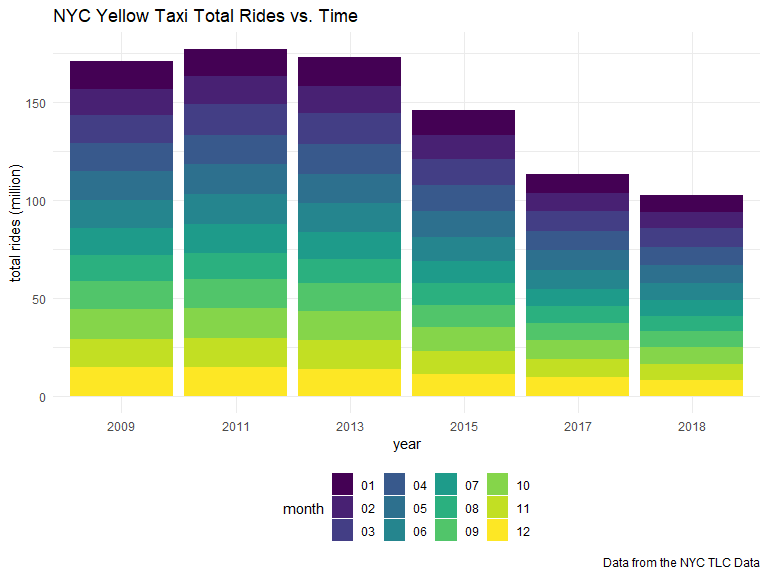
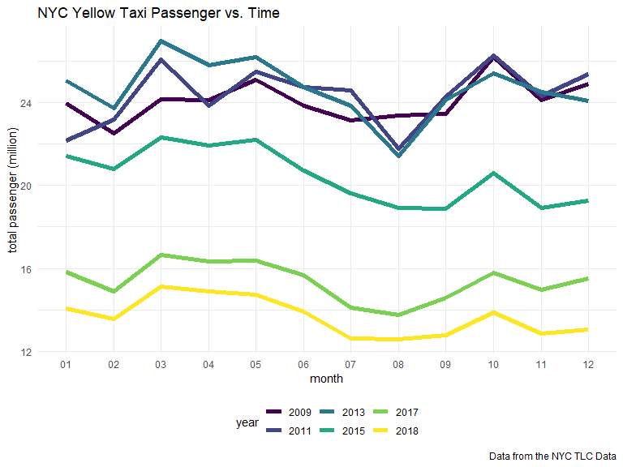
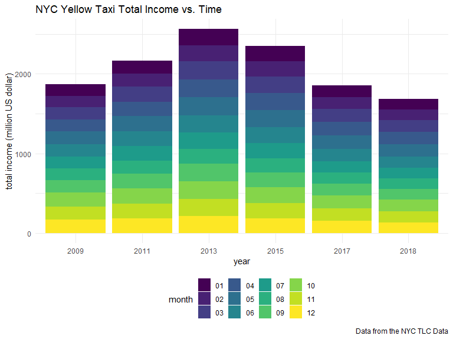
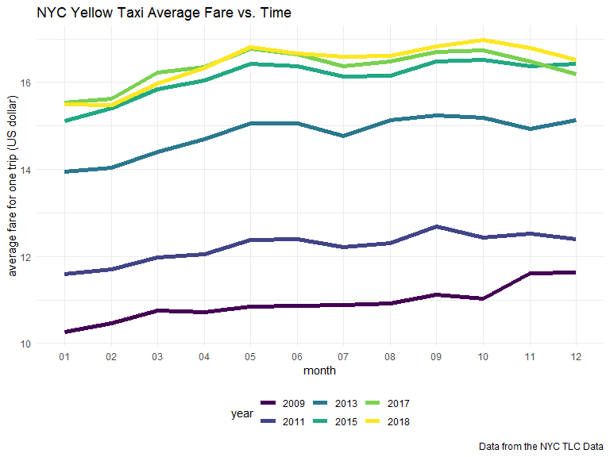

10 Year Overall Analysis
================
Xun Wang
12/2/2019

### 1\. Data Import and Tidy

The code chunk below imports and tidies the overall datasets from 2009
to 2018.

``` r
file_name = list.files(path = "data/yearly_summary", pattern = "_taxi_trip_summary")

overall_df_raw = map(.x = file_name, ~ read_csv(str_c("data/yearly_summary/", .x))) 

overall_df = 
  overall_df_raw %>% 
  bind_rows() %>%
  mutate(
    time = str_remove(file, "yellow_tripdata_"),
    time = str_remove(time, ".csv"),
    total_ride_million = total_ride/1000000,
    total_passenger_million = total_passenger/1000000,
    total_fare_million = total_fare/1000000) %>% 
  separate(time, into = c("year", "month"), sep = "_", remove = TRUE) %>%
  #filter(year != 2018) %>% 
  select(year, month, total_ride_million, total_passenger_million, total_fare_million, mean_fare, median_fare)

overall_df
```

    ## # A tibble: 72 x 7
    ##    year  month total_ride_mill~ total_passenger~ total_fare_mill~ mean_fare
    ##    <chr> <chr>            <dbl>            <dbl>            <dbl>     <dbl>
    ##  1 2009  01                14.1             24.0             145.      10.3
    ##  2 2009  02                13.4             22.5             140.      10.5
    ##  3 2009  03                14.4             24.2             155.      10.7
    ##  4 2009  04                14.3             24.1             153.      10.7
    ##  5 2009  05                14.8             25.1             160.      10.8
    ##  6 2009  06                14.2             23.9             154.      10.9
    ##  7 2009  07                13.6             23.1             148.      10.9
    ##  8 2009  08                13.7             23.4             149.      10.9
    ##  9 2009  09                14.0             23.5             156.      11.1
    ## 10 2009  10                15.6             26.2             172.      11.0
    ## # ... with 62 more rows, and 1 more variable: median_fare <dbl>

### 2\. 10-Year Overall Analysis

To study changes of NYC yellow taxi usage in the past ten years, we
analyze total rides, total passenger numbers, total income and average
income for one trip between 2009 and 2018. The plots are as below.

The code chunk below plots **how the NYC yellow taxi total rides change
with time**.

``` r
total_ride_plot = 
  overall_df %>% 
  ggplot(aes(year, weight = total_ride_million, fill = month)) +
  geom_bar(position="stack") +
  labs(title="NYC Yellow Taxi Total Rides vs. Time", 
       y = "total rides (million)",
       caption = "Data from the NYC TLC Data")

total_ride_plot
```



The code chunk below plots **how the NYC yellow taxi total passengers
change with time**.

``` r
total_passenger_plot = 
  overall_df %>% 
  ggplot(aes(x= month, y = total_passenger_million, color = year, group = year)) +
  geom_line(size = 2) +
  labs(title="NYC Yellow Taxi Passenger vs. Time", 
       y = "total passenger (million)",
       caption = "Data from the NYC TLC Data")

total_passenger_plot
```



The code chunk below plots **how the NYC yellow taxi total income change
with time**.

``` r
total_fare_plot = 
  overall_df %>% 
  ggplot(aes(year, weight = total_fare_million, fill = month)) +
  geom_bar(position="stack") +
  labs(title="NYC Yellow Taxi Total Income vs. Time", 
       y = "total income (million US dollar)",
       caption = "Data from the NYC TLC Data")

total_fare_plot
```



The code chunk below plots **how the NYC yellow taxi average fare for a
single trip change with time**.

``` r
ave_fare_plot = 
  overall_df %>% 
  ggplot(aes(x= month, y = mean_fare, color = year, group = year)) +
  geom_line(size = 2) +
  labs(title="NYC Yellow Taxi Average Fare vs. Time", 
       y = "average fare for one trip (US dollar)",
       caption = "Data from the NYC TLC Data")

ave_fare_plot
```


