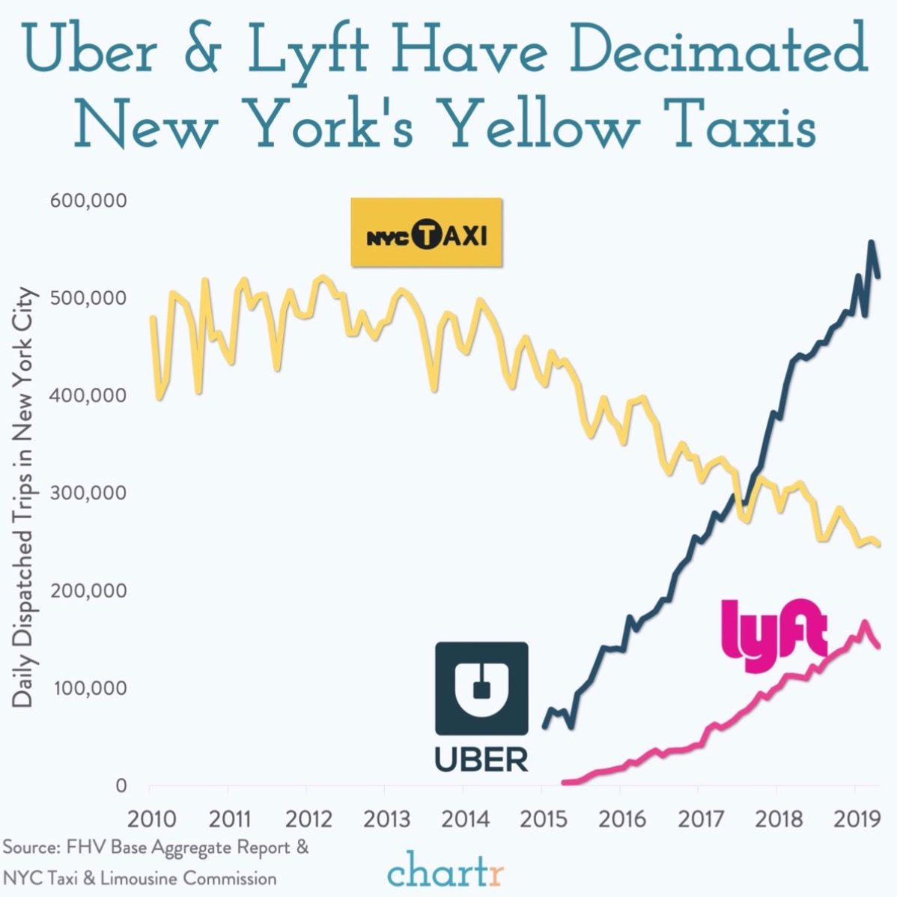

   

## Motivation:

Taxicab service has been around New York City for as early as the late 1890s and has since been a major player in the NYC transportation system. In 2011, the ridesharing company Uber went alive in New York City, and disrupted the taxicab business tremendously. Since the emergence of Uber, taxi usage and profits have gone down, causing the value of NYC taxi medallion to go down by more than 80%. In NYC, there are more rideshare vehicles than taxi medallion vehicles. In addition, with the increasing prevalence of smartphones, more people choose to order and pay for their rides via ride-sharing apps. 

   

## Initial Questions
   
In this report, we ask the question, NYC taxicabs, besides being part of the NYC signature look, do we still need them around? Our goal is to provide data-driven insights into the taxicab operation in NYC and determine if and why NYC cabs should still be around for a while. 

* How many passengers have NYC taxies picked up over the past couple of years? 
* How much does weather affect the cab business? 
* what factors might affect the tips given?
* How did time and distance affect fare amount based on the codebook on the NYC Taxi Website?
   
## What We Found

* We made plots showing Yellow Taxi usage over the past 10 years and specifically, trend in 2018. 

* In the overall description part, we found that:

* We found no significant association between weather and Taxi drives. However, Cold months from Feburary to April did have higher daily taxi usage compared to other months, we concluded that extreme bad weather in cold months did sitimulate taxi service in New York City. No obvious association between precipitation and daily drive amount was observed in 2018. 

* Heatmap:

* We also fitted a linear regression model to further analyze the asssociation between fare amount and travel time and distance. There is positive association between fare amount and travel time and distance. The coefficient of travel duration is 0.33 (p<0.0001), and the coefficient of travel distance is 2.07 (p<0.0001). However, the results of model diagnostics indicate that the model violate some assumptions of linear regression. Therefore, it can only be used as a rough reference for fare amount estimation. 

* Even thogh we hypothesized that the tip percent may be associated with trip distance, passenger count and daily precipitation, the scatterplot shows little relevance amont these factors. 

## Data sources:

* [NYC TLC Trip Record Data](https://www1.nyc.gov/site/tlc/about/tlc-trip-record-data.page)
* [NYC RNOAA](https://data.nodc.noaa.gov/cgi-bin/iso?id=gov.noaa.ncdc:C00861
)

## Discussion

For 2018, although we hypothesized that adverse weather events like low and high average daily temperature and precipitation will increase taxi usage, we did find an obvious trend. This can be due to facotrs like travel distance and time, as people might only choose taxi drive for shorter distance and barely stayed at home in bad weathers. 

