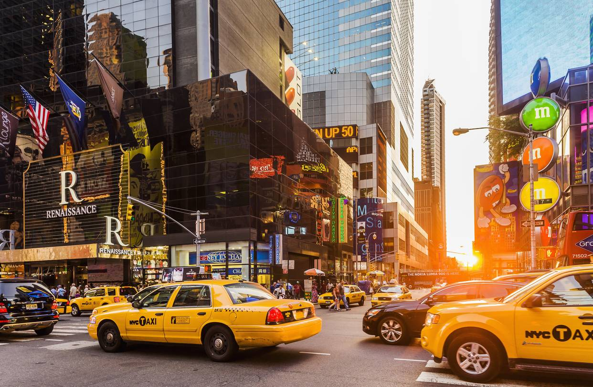

   

## Motivation

Taxicab service has been around New York City for as early as the late 1890s and has since been a major player in the NYC transportation system. In 2011, the ridesharing company Uber went alive in New York City, and disrupted the taxicab business tremendously. Since the emergence of Uber, taxi usage and profits have gone down, causing the value of NYC taxi medallion to go down by more than 80%. In NYC, there are more rideshare vehicles than taxi medallion vehicles. In addition, with the increasing prevalence of smartphones, more people choose to order and pay for their rides via ride-sharing apps. 

   

## Initial Questions
   
In this report, we ask the question, NYC taxicabs, besides being part of the NYC signature look, do we still need them around? Our goal is to provide data-driven insights into the taxicab operation in NYC and determine if and why NYC cabs should still be around for a while. 

* What is the overview of NYC yellow cab operations over the past 10 years? 
* How did weather (i.e. temperature and precipitation) affect the use of yellow cab?
* What factors might affect the tips given?
* How did duration and distance affect fare amount?
   
## What We Found

* We made plots showing Yellow Taxi usage over the past 10 years and specifically, trend in 2018. 

* In the overall description part, we found that with time goes by, fewer and fewer people are using the NYC yellow cab. Even though the fare for a single trip is increasing, the total income from these cabs is decreasing and almost 1 billion dollars vanished in 2018 compared with 2013.  

* We found no significant association between weather and taxi usage. However, cold months from Feburary to April did have higher daily taxi usage compared to other months, we concluded that extreme bad weather in cold months did sitimulate taxi service in New York City. No obvious association between precipitation and daily drive amount was observed in 2018. 

* Peak hour of yellow cab trips to different boroughs (plus Newark) had different patterns. Trips to Newark had a clear peak in the afternoon hours. In Staten Island, Bronx, or Brooklyn, there were more trips at night (8pm - 1am). Trips to Queens were relatively evenly spread out across 24 hours, while trips to Manhattan were more likely to be in the daytime. 

* We also fitted a linear regression model to further analyze the asssociation between fare amount and travel duration and distance. There is positive association between fare amount and travel duration and distance. The coefficient of travel duration is 0.35 (p<0.0001), and the coefficient of travel distance is 2.00 (p<0.0001). However, the results of model diagnostics indicate that the model violate some assumptions of linear regression. Therefore, it can only be used as a rough reference for fare amount estimation. 

* Even thogh we hypothesized that the tip percent may be associated with trip distance, passenger count and daily precipitation, the scatterplot shows little relevance amont these factors. We did, however, find that within Manhattan, for both pickup and drop-off, downtown riders pay more than uptown riders.

## Data Sources

The two data sources we use are as follows. Detailed information about the raw data can be found from the *Data* tab on the top.

* [NYC TLC Trip Record Data](https://www1.nyc.gov/site/tlc/about/tlc-trip-record-data.page)
* [NYC RNOAA](https://data.nodc.noaa.gov/cgi-bin/iso?id=gov.noaa.ncdc:C00861
)

## Discussion

In our study, we find some interesting points about NYC yellow cab usage: New Yorkers use yellow cabs less during the summer; and they take yellow cabs to different NYC boros at different time; New Yorkers don't give more tips even with longer trip distance, more passengers or heavier daily precipitation. However, from previous studies, people proposed negative effects from shared traveling on NYC yellow cab usage. Our results shows a tremendous decrease of yellow cab usage in the past 10 years, in both customer numbers and income. From our findings, it seems the future of the NYC yellow cab is not very bright. Good luck NYC yellow cabs!
   
## Screencast

For a brief overview of this website, please view our [screencast](https://youtu.be/Uu_z8SPygq8)

<iframe width="560" height="315" src="https://www.youtube.com/embed/Uu_z8SPygq8" frameborder="0" allow="accelerometer; autoplay; encrypted-media; gyroscope; picture-in-picture" allowfullscreen></iframe> 