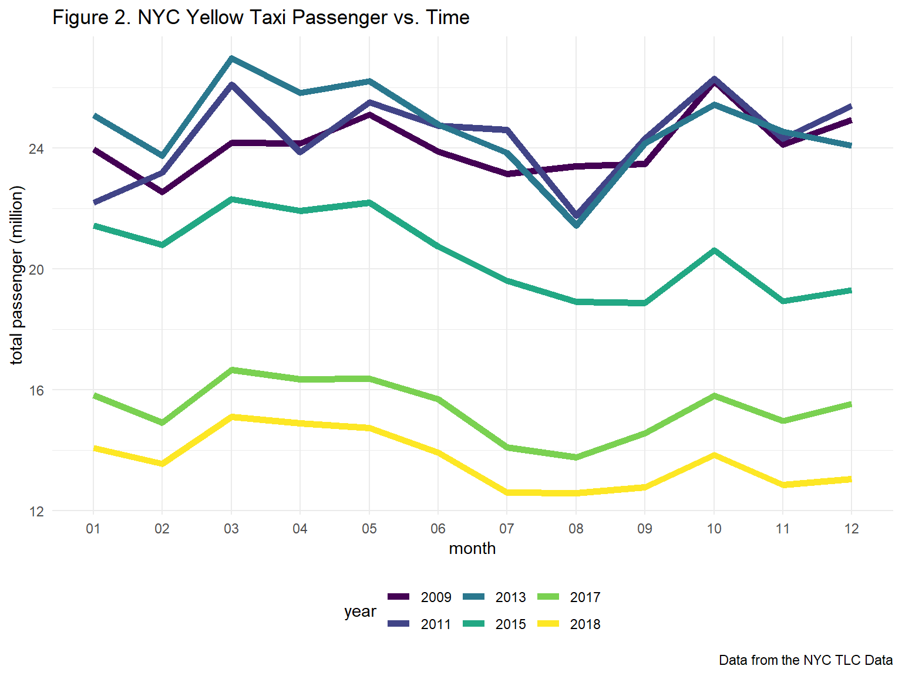
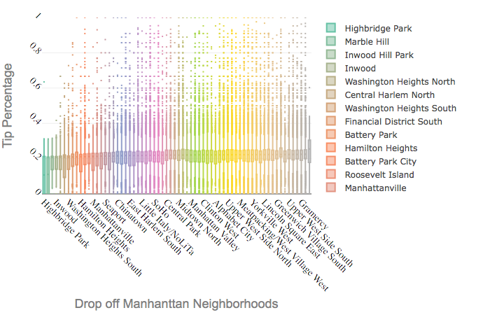
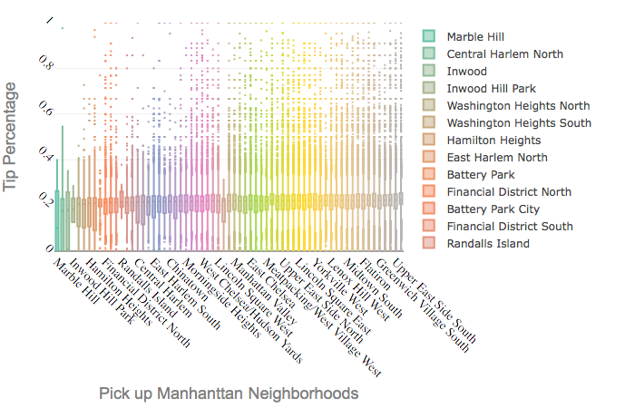

### Authors

* Xun Wang: xw2417
* Ran An: ra2965
* Yuqing Xue: yx2507
* Xintao Ding: xd2222
* Xinyu Yang: xy2396

## Introduction & Motivation:

Taxicab service has been around New York City for as early as the late 1890s and has since been a major player in the NYC transportation system. In 2011, the ridesharing company Uber went alive in New York City, and disrupted the taxicab business tremendously. Since the emergence of Uber, taxi usage and profits have gone down, causing the value of NYC taxi medallion to go down by more than 80%. In NYC, there are more rideshare vehicles than taxi medallion vehicles. In addition, with the increasing prevalence of smartphones, more people choose to order and pay for their rides via ride-sharing apps. 

## Initial Questions:
   
In this report, we ask the question, NYC taxicabs, besides being part of the NYC signature look, do we still need them around? Our goal is to provide data-driven insights into the taxicab operation in NYC and determine if and why NYC cabs should still be around for a while. 

**  What is the overview of NYC yellow cab operations over the past 10 years? 
**  How did weather (i.e. temperature and precipitation) affect the use of yellow cab? 
**  What factors might affect the tips given?
**  How did duration and distance affect fare amount?

## Data Tidy

We use public dataset from webistes 

**NYC Weather Data:** The weather of New York City (NYC) in 2018 raw data is from the [Global Historical Climatology Network's daily data (GHCND)](https://www.ncdc.noaa.gov/data-access/land-based-station-data/land-based-datasets/global-historical-climatology-network-ghcn). This dataset can be downloaded by `rnoaa::meteo_pull_monitors`.

**NYC Yellow Taxi Data:** The NYC yellow taxi raw data is from the  [TLC TriP Record Data](https://www1.nyc.gov/site/tlc/about/tlc-trip-record-data.page). 

It contains all the yellow taxi trip records in NYC from 2009 to 2019. First, to analyze change of the NYC yellow taxi use across 10 years, we focus on Yellow Taxi Trip Records raw data in every month of 2009, 2011, 2013, 2015, 2017. Next, to analyze change of the NYC yellow taxi use in detail, we focus on the year of 2018 and generate randomly sampled sub-datasets for each month in 2018. Because the raw data is too large, we put it in a folder named *raw_data* and added it to the `.gitignore` file. So the *raw_data* folder was not uploaded to the Github. The monthly sub-datasets were generated by randomly sampling 100,000 observations from each month of 2018 and saved in the folder *data*.

For weather related data, we extracted minimum temperature`tmin` and maximum temperature `tmax` and precipitation data`prcp` in 2018 and then joined with taxi data by month and date.

## Part 1 10-Year Overall Analysis

#### 1.1 Introduction

With the development of shared traveling methods such as Uber, Lyft, VIA etc., what will the demands for NYC yellow taxi change? Will we still need these cute yellow cabs in the future? In this section, we analyze the usage of NYC yellow taxi in the past 10 years, trying to shed light on the future of the yellow cab in NYC.

#### 1.2 Data Import and Tidy

To analyze the overall change of NYC yellow taxi usage, we import and tidy yearly summary datasets from 2009 to 2018 in the folder *data/yearly_summary*. It combines information of rides, passenger numbers, fares in 2009, 2011, 2013, 2015, 2017, 2018 to form a `overall_df`.

```{r overall_df, eval = FALSE}
file_name = list.files(path = "data/yearly_summary", pattern = "_taxi_trip_summary")

overall_df_raw = map(.x = file_name, ~ read_csv(str_c("data/yearly_summary/", .x))) 

overall_df = 
  overall_df_raw %>% 
  bind_rows() %>%
  mutate(
    time = str_remove(file, "yellow_tripdata_"),
    time = str_remove(time, ".csv"),
    total_ride_million = total_ride/1000000,
    total_passenger_million = total_passenger/1000000,
    total_fare_million = total_fare/1000000) %>% 
  separate(time, into = c("year", "month"), sep = "_", remove = TRUE) %>%
  #filter(year != 2018) %>% 
  select(year, month, total_ride_million, total_passenger_million, total_fare_million, mean_fare, median_fare)
```

#### 1.3 10-Year Overall Analysis

To study changes of NYC yellow taxi usage in the past ten years, we analyze total rides, total passenger numbers, total income and median income for one trip in 2009, 2011, 2013, 2015, 2017, 2018.

##### 1.3.1 NYC yellow cab ride and passenger numbers are decreasing

First, we look at how the NYC yellow cab **ride number (Fig. 1)** and the **passenger number (Fig. 2)** change with time. From Figure 1, we can see that the total number of taxi rides starts to decrease since 2011 and has decreased by more than **40%** in the past 10 years, and monthly ride numbers are decreasing comparing two adjacent years. Figure 2 shows how the total passenger numbers change with time. When comparing within a single year, one interesting result is that fewer people take yellow taxis during the summer (July, August and September) even more tourists are in NYC then. When comparing among different years, the total passenger number has been also decreasing since 2011, and has also decreased by more than **40%** in the past 10 years.

Therefore, in the past 10 years, **NYC yellow cab has had fewer and fewer usage and customers!!!**

```{r total_ride_plot, eval = FALSE}
total_ride_plot = 
  overall_df %>% 
  ggplot(aes(year, weight = total_ride_million, fill = month)) +
  geom_bar(position = "stack") +
  labs(title = "Figure 1. NYC Yellow Taxi Total Rides vs. Time", 
       y = "total rides (million)",
       caption = "Data from the NYC TLC Data")

total_ride_plot
```


```{r total_passenger_plot, eval = FALSE}
total_passenger_plot = 
  overall_df %>% 
  ggplot(aes(x = month, y = total_passenger_million, color = year, group = year)) +
  geom_line(size = 2) +
  labs(title = "Figure 2. NYC Yellow Taxi Passenger vs. Time", 
       y = "total passenger (million)",
       caption = "Data from the NYC TLC Data")

total_passenger_plot
```



##### 1.3.2 NYC yellow cab is more expensive for a single ride 

Second, we look at how the price of taking a yellow cub changes with time and plot the relationship between media fare for a single trip and time time as Figure 3. From Figure 3, we can see that the median fare for a single trip is increasing within a year and among different years with time goes by. For a single trip, the median fare has increased by about **45%**.

Therefore, in the past 10 years, **NYC yellow cab has become more and more expensive!!!**

```{r median_fare_plot, eval = FALSE}
median_fare_plot =
  overall_df %>% 
  ggplot(aes(x = month, y = mean_fare, color = year, group = year)) +
  geom_line(size = 2) +
  labs(title = "Figure 3. NYC Yellow Taxi Median Fare vs. Time", 
       y = "median fare for one trip (US dollar)",
       caption = "Data from the NYC TLC Data")

median_fare_plot
```


##### 1.3.3 NYC yellow cab gets lower income 

At last, we look at how the gross income from the NYC yellow cab changes with time. We plot the relationship between total income and time as Figure 4. From Figure 4, we can see that the total income from the NYC yellow cab reaches to the peak in 2013. This might because the customer number didn't decrease too much while the median fare for a single trip increased a lot in 2013 compared with 2012. However, the total income has decreased by about **30%** (amost 1 billion dollars!) in the past 5 years. 

Therefore, **the total income from the NYC yellow cab has been decreasing since 2013**. 

```{r total_fare_plot, eval = FALSE}
total_fare_plot = 
  overall_df %>% 
  ggplot(aes(year, weight = total_fare_million, fill = month)) +
  geom_bar(position = "stack") +
  labs(title = "Figure 4. NYC Yellow Taxi Total Income vs. Time", 
       y = "total income (million US dollar)",
       caption = "Data from the NYC TLC Data")

total_fare_plot
```


#### 1.4 Conclusion

From the analysis of overall data of the NYC yellow cab in the past 10 years, we know that with time goes by, fewer and fewer people are using the NYC yellow cab. Even though the fare for a single trip is increasing, the total income from these cute cabs is decreasing and almost 1 billion dollars vanished in 2018 compared with 2013. Therefore, the future of the NYC yellow cab is not very bright. Good luck! 

## Part 2 2018 Trip Pattern

#### 2.1 Temperature and Taxi Use
   
#####  2.1.1 Background

Previous work have shown that there are relationships between taxi ridership and weather events.“During adverse weather, taxi drivers tend to make more money” (Kamga et al., 2013). Kamga et al. also found that during days when adverse weather took place, there was a higher demand for taxis in Manhattan compared to the other boroughs, and that more people were prone to take shorter taxi trips.

##### 2.1.2 Data Tidy

In this part, we wanted to see whether there is a trend between weather and yellow cab within and between months use using our data. We used the weather data including temperature and precipitation data in 2018 and their corresponding yellow taxi use data. For temperature, we used average temperature `average_temp ` as the mean of maximum temperarure and miniminum temperature in each day. For yellow cab data, we used the raw data for 2018 from NYC Taxi Website, counted the daily taxi usage by `pick_up_data` and then joined the weather dataset by month and date.


```{r, eval = FALSE}
weather_tot = read_csv(file = "./data/weather_nyc_2018.csv") %>%
  mutate(date = as.character(date)) %>%
  separate(date, into = c("year","month","pu_date"), sep = "-", convert = TRUE) %>%
  mutate(
  average_temp = (tmin + tmax) / 2)
  

yellowcab = read_csv(file = "./data/yearly_summary/2018_taxi_trip_daily_summary.csv") %>%
  mutate(date = as.character(vars),
         daily_drive = n) %>%
  separate(date, into = c("year","month","pu_date"), sep = "-", convert = TRUE) %>%
  select(-vars, -year)

cab_weather =
  left_join(weather_tot,yellowcab, by = c("month","pu_date")) %>%
  select(month, pu_date,average_temp, daily_drive,prcp) %>%
  mutate(month = as.factor(month),
         month = recode_factor(month, '1' = "January", '2' = "Feburary", '3' = "March", '4' = 'April', '5' = 'May', '6' = 'June', '7' = 'July', '8' = 'August', '9' = 'September', '10' = 'October', '11' = 'November', '12' = 'December'))
```

##### 2.1.3 Plot for the association between Weather and Daily Taxi Usage

Here we made an animation plot to show the daily drive amount and average daily temperature for each month.The size of the dots showed the precipitaiton for that day which help to identify whether rainy weather also increase taxi use. 

Although we hypothesized that cold weather and hot weather might have more taxi use, there was no obvious usage increase in summer time. While, we did observed high daily drive amount in Feburary, March and April which are the four coldest months in NYC. Also, no interaction between month and average temperature was being observed. In terms of the influence of precipitation, we didn't observe a significant pattern. Contrast to what we guessed before, instead of increase daily drive amount, rainy days had lower drive amount. This might due to the reason that people would just stay at home during days with heavy rain or snow. Also, if we adjustded for distance, there might be a significant association between precipitation and short distance drive. 

```{r, eval = FALSE}
weather_plot = cab_weather %>%
  ggplot(aes(x = average_temp, y = daily_drive, frame_vars(month))) +
  geom_point(aes(size = prcp, colour = month)) +
   labs(title = ' Plot for the association between Weather and Daily Taxi Usage ',
       x = 'Daily Average Temperature for Year 2018', 
       y = 'Daily Drive Amount',
       colour = 'Month',
       size = 'Precipitation'
       ) 
```


```{r, eval=FALSE}
zone_lookup <-
  read_csv("./data/taxi_zone_lookup.csv") %>% 
  janitor::clean_names() %>% 
  select(-service_zone)

file_names <- list.files("./data/yellow_cab")
read_in = function(x) {
  read_csv("./data/yellow_cab/x") 
}
setwd("./data/yellow_cab")
taxi_2018 <-
  file_names %>% 
  set_names() %>% 
  map_dfr(read_csv, .id = "source") %>% 
  separate(source, c("a","b","year", "month", "c"), sep = "([\\.\\_])") %>% 
  select(-a, -b, -c, -X1)
```

```{r eval = FALSE}
heatmap <-
  taxi_2018 %>% 
  filter(
    passenger_count != 0,
    trip_distance != 0,
    total_amount > 0,
    fare_amount != 0
  ) %>% 
  mutate(tpep_pickup_datetime = as.character(tpep_pickup_datetime),
         tpep_dropoff_datetime = as.character(tpep_dropoff_datetime)) %>%
  separate(tpep_pickup_datetime, into = c("a","b"), sep = " ") %>%
  separate(a, into = c("pick_year","pick_month","pu_date"), sep = "-") %>%
  separate(b, into = c("pu_hour","pu_min"), sep = ":") %>%
  separate(tpep_dropoff_datetime, into = c("c","d"),sep = " ") %>%
  separate(c,into = c("drop_year","drop_month","do_date"),sep = "-") %>%
  separate(d, into = c("do_hour","do_min"), sep = ":") %>%
  select(-pick_month,-drop_month,-pick_year,-drop_year) %>% 
  mutate(
    month = as.integer(month),
    pu_date = as.integer(pu_date),
    pu_hour = as.integer(pu_hour),
    pu_min = as.integer(pu_min),
    do_date = as.integer(do_date),
    do_hour = as.integer(do_hour),
    do_min = as.integer(do_min)
  ) %>% 
  left_join(zone_lookup, by = c("pu_location_id" = "location_id")) %>% 
  rename(
    pu_boro = borough,
    pu_zone = zone
  ) %>% 
  left_join(zone_lookup, by = c("do_location_id" = "location_id")) %>% 
  rename(
    do_boro = borough,
    do_zone = zone
  ) %>% 
  select(-pu_location_id, -do_location_id)
```

#### 2.2 Destination, Time, and Taxi Use
   
##### 2.2.1 Background and Data
   
We also looked at the yellow cab trip pattern across 24 hours in a day in the five boroughs plus Newark airport. The trip destination in the orginal data was coded in taxi zone, and information of borough was obtained by joining with the look-up table of taxi zones provided at the NYC Yellow Taxi Data webisite. Pick up time was used for the hour in a day. We then calcualted the percentage of trips in each hour among the total trips to a specific destination.

##### 2.2.2 

Heatmap of Destination Borough and Hour in a Day
   
```{r, eval = FALSE}
ax_1 <- list(
  title = "Hour in Day",
  type = 'category',
  showticklabels = TRUE)

ax_2 <- list(
  title = "Dstination",
  showticklabels = TRUE)

heatmap %>% 
  filter(do_boro != "Unknown") %>% 
  select(do_boro, pu_hour) %>% 
  mutate(
    do_boro = fct_infreq(do_boro)
  ) %>% 
  group_by(do_boro, pu_hour) %>% 
  count() %>% 
  group_by(do_boro) %>% 
  mutate( 
    total = sum(n)
    ) %>% 
   mutate(percent = round((n/total)*100,1)) %>% 
  arrange(do_boro, pu_hour) %>% 
    plot_ly(
    x = ~pu_hour, y = ~do_boro,
    height = 400, width = 1400) %>%
  add_heatmap(
    z = ~percent,
    text = ~paste(
      "Trip to: ", do_boro, "<br>Pickup Time: ", pu_hour, ": 00",
      "<br>Percent: ", percent, "%"),
    hoverinfo = "text", showscale = TRUE,
    opacity = 0.90) %>%
    layout(xaxis = ax_1, yaxis = ax_2)
```


Each square in the heatmap represents a unique combination of destination boroughs and 24 hours in a day, and the color represents the percent of trip amount out of the total trip amount in that  borough,  with brighter color represents higher percent.
   
We can see that in boroughs like Staten Island, Bronx, or Brroklyn, there were more trips to these places in night or late night (8pm - 1am) than in the day time. Trips to Queens were relatively evenly spread out across hours in a day and trips to Manhattan were more likely to be in the day  rather than in the night. Trips to Newark had a clear peak in the afternoon hours.

## Part 3 Fare 

We are interested in the factors that potentially effect the revenue of each taxi trip. The total amount is the sum of fare amount, tax, tip amount, tolls amount and [improvement surcharge](https://www1.nyc.gov/site/tlc/about/taxi-improvement-fund.page). Tolls amount is fixed. Since tax and tip are dependent on fare amount, we are interested in fare amount. 

According to a tipping guide that's published by The New York Times in their Travel section back in 2006, the tipping rate is 15-20% for taxi drivers. So much has chnanged since then. Uber, lyft and other ride-hailing service companies have entered the market; paying has never become easier now that you can pay through an app on your phone and choose how much you want to tip. Even though most of time the tip percent will fall between 15% and 20% in NYC, it still varies across difference trips. We also hope to explore the reasons for higher tip percent. 

### Fare Amount

The rule of standard metered taxi fare is too [complicated](https://www1.nyc.gov/site/tlc/passengers/taxi-fare.page) . It is difficult for a passenger to estimate the fare amount refering to such complext instructions.

According to the codebook from the TLC website, the fare amount is defined as "The time-and-distance fare calculated by the meter". Therefore, we hope to explore the association between fare amount and trip distance and duration. If possible, we also want to roughly predict the fare amount by duration and distance.

Data was queried from year 2018, covering all NYC boroughs. The duration is calculated from drop-off time and pick-up time. There might be data entry error since a large number of records with fare_amount of 52 have different distance and duration. We are also not interested in the trips with no time or a long duration, i.e. longer than 6 hours. The initial charge of NYC Yellow Cab is 2.5 dollars. Therefore, we exclude the data with duration longer than 360 or equals to 0, fare amount of 52 or less than 2.5.

```{r, eval = FALSE}
library(ggplot2)
library(PerformanceAnalytics)
library(mctest)
library(ppcor)
library(patchwork)
library(tidyverse)
library(plotly)


weather <-
  read_csv("./data/weather_nyc_2018.csv") %>% 
  mutate(date = as.character(date)) %>%
  separate(date, into = c("year","month","day"), sep = "-", convert = TRUE) %>%
  dplyr::select(-year, -name, -id)

zone_lookup <-
  read_csv("./data/taxi_zone_lookup.csv") %>% 
  janitor::clean_names() %>% 
  dplyr::select(-service_zone)

file_names <- list.files("./data/yellow_cab")
read_in = function(x) {
  read_csv("./data/yellow_cab/x") 
}
setwd("./data/yellow_cab")

taxi_2018 <-
  file_names %>% 
  set_names() %>% 
  map_dfr(read_csv, .id = "source") %>% 
  separate(source, c("a","b","year", "month", "c"), sep = "([\\.\\_])") %>% 
  dplyr::select(-a, -b, -c, -X1)
```

```{r, eval = FALSE}
pilot <-
  taxi_2018 %>% 
  filter(
    passenger_count != 0,
    trip_distance != 0,
    total_amount > 0,
    fare_amount != 0
  ) %>% 
  mutate(tpep_pickup_datetime = as.character(tpep_pickup_datetime),
         tpep_dropoff_datetime = as.character(tpep_dropoff_datetime)) %>%
  separate(tpep_pickup_datetime, into = c("a","b"), sep = " ") %>%
  separate(a, into = c("pick_year","pick_month","pu_date"), sep = "-") %>%
  separate(b, into = c("pu_hour","pu_min"), sep = ":") %>%
  separate(tpep_dropoff_datetime, into = c("c","d"),sep = " ") %>%
  separate(c,into = c("drop_year","drop_month","do_date"),sep = "-") %>%
  separate(d, into = c("do_hour","do_min"), sep = ":") %>%
  dplyr::select(-pick_month,-drop_month,-pick_year,-drop_year) %>% 
  mutate(
    month = as.integer(month),
    pu_date = as.integer(pu_date),
    pu_hour = as.integer(pu_hour),
    pu_min = as.integer(pu_min),
    do_date = as.integer(do_date),
    do_hour = as.integer(do_hour),
    do_min = as.integer(do_min)
  ) %>% 
  left_join(weather, by = c("month" = "month", "pu_date" = "day")) %>% 
  left_join(zone_lookup, by = c("pu_location_id" = "location_id")) %>% 
  rename(
    pu_boro = borough,
    pu_zone = zone
  ) %>% 
  left_join(zone_lookup, by = c("do_location_id" = "location_id")) %>% 
  rename(
    do_boro = borough,
    do_zone = zone
  ) %>% 
   dplyr::select(-pu_location_id, -do_location_id)

reg = pilot %>% 
  mutate(
    duration = case_when(
    pu_date != do_date ~ do_min - pu_min + (60 *(do_hour - pu_hour + 24)),
    pu_date == do_date ~ do_min - pu_min + (60 *(do_hour - pu_hour) )
  ),
      tip_percent = tip_amount/fare_amount
  ) %>% 
  filter(duration != 0,
         fare_amount != 52,#There might be data entry error since all records that fare_amount is 52 have different distance and duration#
         duration <= 360, #There are some points gathering with a long duration without long distance, which can be miscoding or influntial outliers, so we should exclude these data.#
         fare_amount >= 2.5 #There can be data entry error since the initial charge of NYC taxi is $2.5, so we exclude those with fare amount < $2.5.#
         ) 
 
set.seed(1)
reg_plot = reg %>% 
  sample_frac(size = 0.1, replace = FALSE)

```

### Scatterplot of fare amount by distance and duration

```{r, eval = FALSE}
 
fare_distance = reg_plot %>% 
  ggplot(aes(x = trip_distance, y = fare_amount)) +
  geom_point(alpha = 0.3, color = 'skyblue',size = 0.3) +
  labs(
    title = "The distribution of fare amount by trip distance and duration",
    x = "Trip Distance",
    y = "Fare Amount"
  )

fare_duration = reg_plot %>% 
  ggplot(aes(x = duration, y = fare_amount)) +
  geom_point(alpha = 0.3, color = 'red', size = 0.3) +
  labs(
    x = "Trip Duration",
    y = "Fare Amount"
  )

fare_distance + fare_duration
```


According to the scatterplots, there is a positive relationship among trip distance and fare amount. Trip duration is also positively associated with fare amount.

### Building linear regression model of fare amount

The outcome of linear regression model is fare amount, and the predictors include trip distance and duration.

```{r, eval = FALSE}
fit1 = lm(fare_amount ~ duration + trip_distance , data = reg) %>% 
  broom::tidy() %>% 
  janitor::clean_names() %>% 
  mutate(p = round(p_value,3))

fit1 = lm(fare_amount ~ duration + trip_distance , data = reg ) 
summary(fit1) %>% broom::tidy() %>% knitr::kable(digit = 2)
```


```{r, eval = FALSE}
summary(fit1) %>% broom::glance() %>% knitr::kable(digit = 2)
```


The p-value of the two coefficients are both < 0.05. It is seen that both variables (duration, trip_distance) are statistically significant at 5 % level of significance. R square of the model is 0.93.

### Diagnostics
Further we can plot the model diagnostic checking for other problems such as normality of error term, heteroscedasticity etc.

```{r, eval = FALSE}
par(mfrow = c (2,2))
plot(fit1)
```

After running the model diagnostics, the model violates the linear regression assumptions. It can be the result of the skewed distribution of fare amount.

```{r, eval = FALSE}
reg_plot %>% 
  ggplot(aes(x = fare_amount)) +
  geom_histogram(bins = 100) +
  labs(
    title = "Distribution of fare amount",
    x = "Fare Amount",
    y = " "
  )
```


In addition, we realized that the duration will increase if the trip distance increased. Therefore, possibly there is multicollinearity problem in this model as well. For further diagnosis of the problem, let us first look at the pair-wise correlation among the explanatory variables.

```{r, eval = FALSE}
corr = reg %>% dplyr::select(trip_distance, duration)
pcor(corr, method = "pearson") 
```  

The correlation between trip distance and duration is 0.74. The p-value is smaller than 0.05, therefore, at 5% level of significance,  trip distance and duration is related to each other. 

```{r, eval = FALSE}
imcdiag(corr, reg$fare_amount)
```

The VIF, TOL and Wi columns provide the diagnostic output for variance inflation factor, tolerance and Farrar-Glauber F-test respectively. Since VIF<10 and TOL>0.1, there is no multicolinearity in the regression model.

### Tip percent

In addition ot fare amount, we are also interested in the factors that may effect tip percent in each trip.

```{r, eval = FALSE}
tip_distance = reg_plot %>% 
  filter(payment_type == 1) %>% 
  ggplot(aes(x = trip_distance, y = tip_percent)) +
  geom_point(alpha = 0.3, color = 'skyblue', size = 0.1,na.rm = TRUE) +
  labs(
    title = "Tip percent by Trip Distance, Passenger Count, Precipitation",
    x = "Trip Distance",
    y = "Tip Percent"
  ) +
  scale_y_continuous(
    limits = c(0,1)
  )

tip_passenger = reg_plot %>% 
  filter(payment_type == 1) %>% 
  ggplot(aes(x = passenger_count, y = tip_percent)) +
  geom_point(alpha = 0.3, color = 'palevioletred2', size = 0.1,na.rm = TRUE) +
  labs(
    x = "Passenger Count",
    y = "Tip Percent"
  ) +
  scale_y_continuous(
    limits = c(0,1)
  )

tip_prcp = reg_plot %>% 
  filter(payment_type == 1) %>% 
  ggplot(aes(x = prcp, y = tip_percent)) +
  geom_point(alpha = 0.3, color = 'palegreen3', size = 0.1,na.rm = TRUE) +
  labs(
    x = "Precipitation",
    y = "Tip Percent"
  ) +
  scale_y_continuous(
    limits = c(0,1)
  )

tip_distance + tip_passenger + tip_prcp
```


There is no clear pattern among tip percent and the three predictors. Therefore, we will not conduct regression analysis about tip percent. Instead, we'll look at the cab-tipping scence is like in Manhattan, where yellow cabs are mostly concentrated. We look at tip percentage, which we generated by dividing the tip amount by the total fare amount. 

```{r, eval = FALSE}
boxplot <- pilot %>%
  filter(fare_amount != 0,
         fare_amount != 52, #We find that there might be an entry error since all records that fare_amount is 52 have different distance and duration
        fare_amount >= 2.5) %>%  #There can be data entry error since the initial charge of NYC taxi is $2.5, so we exclude those with fare amount < $2.5
  mutate(
    duration = case_when(
    pu_date != do_date ~ do_min - pu_min + (60 *(do_hour - pu_hour + 24)),
    pu_date == do_date ~ do_min - pu_min + (60 *(do_hour - pu_hour) )

  ),
      tip_percent = round(tip_amount/fare_amount, 4))
```

Since only tips made by credit card are recorded, we'll only be looking at rides that are paid with a credit card.

```{r eval = FALSE}
tip_plot <-  boxplot %>% 
  filter(payment_type == 1, do_boro == 'Manhattan', pu_boro == 'Manhattan', do_zone != 'Unknown', pu_zone != 'Unknown') %>% 
  mutate(do_zone = forcats::fct_reorder(do_zone, tip_percent),
       pu_zone = forcats::fct_reorder(pu_zone, tip_percent)) %>% 
  drop_na(do_zone, pu_zone)

```

We look at rides that are either picked-up at and dropped-off at a neighborhood in Manhattan. 

### Drop-off Zone
```{r eval = FALSE}
# plotly for do_zone
f1 <- list(
  family = "Arial, sans-serif",
  size = 18,
  color = "grey"
)
f2 <- list(
  family = "Old Standard TT, serif",
  size = 14,
  color = "black"
)
a <- list(
  title = "Tip Percentage",
  titlefont = f1,
  showticklabels = TRUE,
  tickangle = 45,
  tickfont = f2,
  exponentformat = "E",
  range = c(0,1)
)

b <- list(
  title = "Drop off Manhattan Neighborhoods",
  titlefont = f1, 
  showticklabels = TRUE,
  tickangle = 45,
  tickfont = f2,
  exponntformat = "E"
)

c <- list(
  title = "Pick up Manhattan Neighborhoods",
  titlefont = f1, 
  showticklabels = TRUE,
  tickangle = 45,
  tickfont = f2,
  exponntformat = "E"
)

tip_plot %>% 
  mutate(do_zone = forcats::fct_reorder(do_zone, tip_percent),
       pu_zone = forcats::fct_reorder(pu_zone, tip_percent),
       do_median = median(tip_percent),
       text = str_c("Drop Off Zone: ", do_zone , "\nTip Percent: ", tip_percent, "\nMedian Percentage:", do_median) )%>% 
  drop_na(do_zone, pu_zone) %>% 
  plot_ly(y = ~tip_percent, color = ~do_zone, text = ~text, type = "box",  colors = "Set2", marker = list(size = 2))%>% 
  layout(xaxis = b, yaxis = a) 

```



```{r eval = FALSE}
 tip_plot %>% 
  filter(do_zone == "Highbridge Park") %>% 
  mutate(do_median = median(tip_percent))

 tip_plot %>% 
   filter(do_zone == "Randalls Island") %>% 
   mutate(do_median = median(tip_percent))
```

We can see that of all 64 drop-off neighborhoods, Highbridge Park has the lowest median tip percentage at 10.73%, wehre Randalls Island has the highest median tip percentage at 25.46%. Overall, we do see that if the lower the cab go into Manhattan, the higher the percentage of tip is given.

```{r eval = FALSE}
tip_plot %>% 
mutate(do_zone = forcats::fct_reorder(do_zone, tip_percent),
pu_zone = forcats::fct_reorder(pu_zone, tip_percent),
pu_median = median(tip_percent),
text = str_c("Pick Up Zone: ", pu_zone , "\nTip Percent: ", tip_percent, "\nMedian Percentage:", pu_median) )%>%
drop_na(do_zone, pu_zone) %>%
plot_ly(y = ~tip_percent, color = ~pu_zone, text = ~text, type = "box", colors = "Set2", marker = list(size = 2)) %>%
layout(xaxis = c, yaxis = a)
```



```{r eval = FALSE}
tip_plot %>% 
  filter(pu_zone == "Marble Hill") %>% 
   mutate(do_median = median(tip_percent))

 tip_plot %>% 
   filter(pu_zone == "Roosevelt Island") %>% 
   mutate(do_median = median(tip_percent))
```

We can see that of all 66 pick-up neighborhoods, Marble Hill has the lowest median tip percentage at 10.0%, wehre Roosevelt Island has the highest median tip percentage at 21.88%. HOwever, only 8 rides and 15 ride were recorded for Marble Hill and Roosevelt Island respectively. Therefore, the result is not quite representative. However, considering that how restricted public transportation to Roosevelt Island is, I'm not surprised that passengers picked up from there feel generous towards their driver. Overall, we see a similiar trend to the drop-off neighborhoods, if cab driver wants a bigger tip, they should wait around lower Manhattan. 

## Conclusion

In our study, we find some interesting points about NYC yellow cab usage: New Yorkers use yellow cabs less during the summer; and they take yellow cabs to different NYC boros at different time; New Yorkers don't give more tips even with longer trip distance, more passengers or heavier daily precipitation. However, from previous studies, people proposed negative effects from shared traveling on NYC yellow cab usage. Our results shows a tremendous decrease of yellow cab usage in the past 10 years, in both customer numbers and income. From our findings, it seems the future of the NYC yellow cab is not very bright. Good luck NYC yellow cabs!