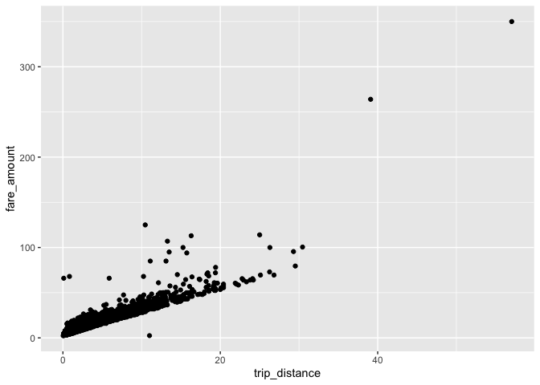
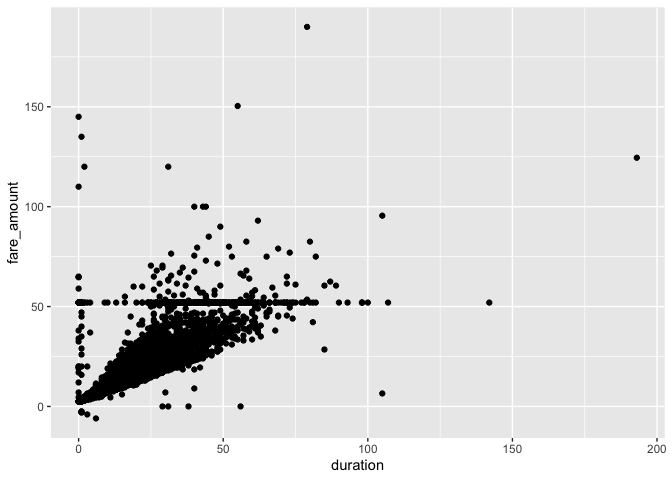

regression analysis
================

``` r
library(tidyverse)
library(ggplot2)

pilot = read.csv("./data/pilot.csv")
taxi_zone_lookup = read.csv("./data/taxi_zone_lookup.csv")
weather_nyc_2018 = read.csv("./data/weather_nyc_2018.csv")


  
reg_sample = pilot %>% 
  mutate(
    duration = case_when(
    pu_date != do_date ~ do_min - pu_min + (60 *(do_hour - pu_hour + 24)),
    pu_date == do_date ~ do_min - pu_min + (60 *(do_hour - pu_hour) )
  )
  ) %>% 
  sample_frac(size = 0.1, replace = FALSE) 

reg_sample %>% 
  ggplot(aes(x = trip_distance, y = fare_amount)) +
  geom_point()
```



``` r
reg_sample %>% 
  filter(duration <= 1000) %>% 
  ggplot(aes(x = duration, y = fare_amount)) +
  geom_point()
```


