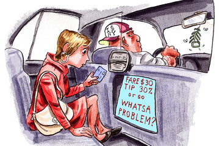

## Cab Tipping in Manhattan

According to a tipping guide that's published by The New York Times in their Travel section back in 2006, the tipping rate is 15-20% for taxi drivers. So much has chnanged since then. Uber, lyft and other ride-hailing service companies have entered the market; paying has never become easier now that you can pay through an app on your phone and choose how much you want to tip. 

We are curious what's the cab-tipping scence is like in Manhattan, where yellow cabs are mostly concentrated.


```{r setup, include=FALSE}
knitr::opts_chunk$set(echo = TRUE, message = FALSE, warning = FALSE)

library(tidyverse)
library(ggplot2)
library(plotly)

pilot = read.csv("./data/pilot.csv")
taxi_zone_lookup = read.csv("./data/taxi_zone_lookup.csv")
weather_nyc_2018 = read.csv("./data/weather_nyc_2018.csv")

```


We look at tip percentage, which we generated by dividing the tip amount by the total fare amount. 
```{r echo = FALSE}
 boxplot <- pilot %>%
  filter(fare_amount != 0,
         fare_amount != 52, #We find that there might be an entry error since all records that fare_amount is 52 have different distance and duration
        fare_amount >= 2.5) %>%  #There can be data entry error since the initial charge of NYC taxi is $2.5, so we exclude those with fare amount < $2.5
  mutate(
    duration = case_when(
    pu_date != do_date ~ do_min - pu_min + (60 *(do_hour - pu_hour + 24)),
    pu_date == do_date ~ do_min - pu_min + (60 *(do_hour - pu_hour) )

  ),
      tip_percent = tip_amount/fare_amount
  )
```


Since only tips made by credit card are recorded, we'll only be looking at rides that are paid with a credit card.
```{r echo = FALSE}
tip_plot <-  boxplot %>% 
  filter(payment_type == 1, do_boro == 'Manhattan', pu_boro == 'Manhattan', do_zone != 'Unknown', pu_zone != 'Unknown') %>% 
  mutate(do_zone = forcats::fct_reorder(do_zone, tip_percent),
       pu_zone = forcats::fct_reorder(pu_zone, tip_percent)) %>% 
  drop_na(do_zone, pu_zone)
```

We look at rides that are either picked-up at and dropped-off at a neighborhood in Manhattan. 

## Drop-off Zone
```{r echo = FALSE}
# plotly for do_zone
f1 <- list(
  family = "Arial, sans-serif",
  size = 18,
  color = "grey"
)
f2 <- list(
  family = "Old Standard TT, serif",
  size = 14,
  color = "black"
)
a <- list(
  title = "Tip Percentage",
  titlefont = f1,
  showticklabels = TRUE,
  tickangle = 45,
  tickfont = f2,
  exponentformat = "E",
  range = c(0,2)
)


b <- list(
  title = "Drop off Manhanttan Neighborhoods",
  titlefont = f1, 
  showticklabels = TRUE,
  tickangle = 45,
  tickfont = f2,
  exponntformat = "E"
)

c <- list(
  title = "Pick up Manhanttan Neighborhoods",
  titlefont = f1, 
  showticklabels = TRUE,
  tickangle = 45,
  tickfont = f2,
  exponntformat = "E"
)


tip_plot %>% 
  mutate(do_zone = forcats::fct_reorder(do_zone, tip_percent),
       pu_zone = forcats::fct_reorder(pu_zone, tip_percent),
       do_median = median(tip_percent),
       text = str_c("Drop Off Zone: ", do_zone , "\nTip Percent: ", tip_percent, "\nMedian Percentage:", do_median) )%>% 
  drop_na(do_zone, pu_zone) %>% 
  plot_ly(y = ~tip_percent, color = ~do_zone, text = ~text, type = "box",  colors = "Set2") %>% 
  layout(xaxis = b, yaxis = a)
```
```{r include = FALSE}
 tip_plot %>% 
  filter(do_zone == "Highbridge Park")
 tip_plot %>% 
   filter(do_zone == "Randalls Island") %>% 
   mutate(do_median = median(tip_percent))
```


We can see that of all 64 drop-off neighborhoods, Highbridge Park has the lowest median tip percentage at 8.0%, wehre Randalls Island has the highest median tip percentage at 26.2%. However, there are only 2 records for which the passenger(s) was dropped off at Highbridge Park, therefore the median tip precentage is not as representative. Overall, we do see that if the lower the cab go into Manhattan, the higher the percentage of tip is given.


## Pick up Zone
```{r echo = FALSE}
tip_plot %>% 
  mutate(do_zone = forcats::fct_reorder(do_zone, tip_percent),
       pu_zone = forcats::fct_reorder(pu_zone, tip_percent),
       pu_median = median(tip_percent),
       text = str_c("Pick Up Zone: ", pu_zone , "\nTip Percent: ", tip_percent, "\nMedian Percentage:", pu_median) )%>% 
  drop_na(do_zone, pu_zone) %>% 
  plot_ly(y = ~tip_percent, color = ~pu_zone, type = "box", colors = "Set2") %>% 
  layout(xaxis = c, yaxis = a)
```


```{r include = FALSE }
tip_plot %>% 
  filter(pu_zone == "Marble Hill")
 tip_plot %>% 
   filter(pu_zone == "Roosevelt Island") %>% 
   mutate(do_median = median(tip_percent))
```

We can see that of all 66 pick-up neighborhoods, Marble Hill has the lowest median tip percentage at 10.0%, wehre Roosevelt Island has the highest median tip percentage at 22.9%. HOwever, only 2 rides and 1 ride were recorded for Marble Hill and Roosevelt Island respectively. Therefore, the result is not quite representative. However, considering that how restricted public transportation to Roosevelt Island is, I'm not surprised that passengers picked up from there feel generous towards their driver. Overall, we see a similiar trend to the drop-off neighborhoods, if cab driver wants a bigger tip, they should wait around lower Manhattan. 
```{r include = FALSE}

do_plot <- tip_plot %>%
  mutate(do_median = median(tip_percent)) %>% 
  mutate(text = str_c("Drop Off Zone: ", do_zone , "\nTip Percent: ", tip_percent, "\nMedian Percentage:", tip_percent)) %>%
    ggplot(aes(x = do_zone, y = tip_percent,color = do_zone)) +
  geom_boxplot(na.rm = TRUE, outlier.size = 0.00001) +
  scale_y_continuous(
    limits = c(0,0.4)
  ) +
  theme(axis.text.x = element_text(angle = 70, hjust = 1), 
        legend.position = "none") +
  viridis::scale_color_viridis(discrete = TRUE)  

ggplotly(do_plot, tooltip = "text")

pu_plot <- tip_plot %>% 
    ggplot(aes(x = pu_zone, y = tip_percent, color = pu_zone)) +
  geom_boxplot(na.rm = TRUE, outlier.size = 0.1) +
  scale_y_continuous(
    limits = c(0,0.4)
  ) +
  theme(axis.text.x = element_text(angle = 70, hjust = 1),
        legend.position = "none") +
  viridis::scale_color_viridis(discrete = TRUE)
ggplotly(pu_plot, tooltip = "text")
```


